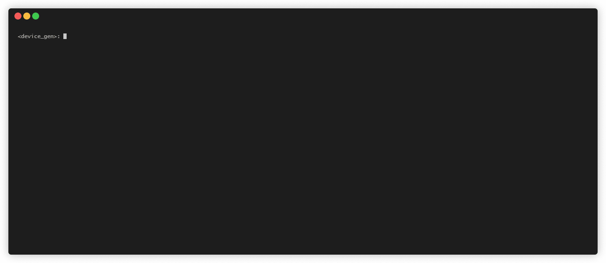

# TikTok API

TikTok is one of the fastest growing platform nowadays, having over 800 million active accounts as of 2020. Having such a large user base, the need for an API that accesses data from it is high demand. In order to meet the needs of the market, the team behind our project worked on a reliable product, so that any business or individual can access valuable data from one of the largest social media platforms.
Our services include

  - Access to the source code of tiktok api
  - Setting up infrastructure in order to suit your needs
  - On demand features developed to specifically meet your requirements

# Features and functionalities
We provide access to a large number of endpoints, such as:
  - Logging in a user with username or email: for cookie retrieval
  - Registering accounts using emails and endpoint for verifying those accounts (works for botting purposes as of 13.01.2021)
  - Liking/disliking a user post or a comment
  - Following/unfollowing a user
  - Commenting on a video
  - Replying to a comment
  - Searching for user by username or secure id
  - Search for hashtags
  - Search for sounds
  - Search for videos
  - Getting a user activity feed (get the latest notifications of a user)
  - Get the likes from a video (capped at 5000 by TikTok)
  - Get user's video (capped at 5000)
  - Get video information
  - Get comments from a video
  - Getting a user profile
  - Upload cover
  - Upload video
  - Get user's followers/followings (capped at 5000)
  - Check if email is already used for other account endpoint
  - [TO BE IMPLEMENTED] Change user nickname
  - [TO BE IMPLEMENTED] Change user profile picture

Having said that, our API includes all of the latest security features tiktok has in place, in order to ensure the maximum effiency in getting the data:

  - xGorgon version 0408, emulated. 
  - Xlog (version 02) activated devices to eliminate the shadowbanning, in source code
  - TT encrypt algorithm, in source code, used for encrypting data in the device register process
  - All the headers being correctly calculated
  - App log events

The source code of the solution is written in Python, but can be rewritten in any desired C based programming language upon request.

# Device register demo

# Limitations

Currently known limitations are :

- Getting any information from a user's profile is capped at 5000 items by Tiktok and cannot be bypassed in any way
- Using the API the right way, it can easily sustain to up to 10 million requests daily (with only one device for gorgon calculation) for scraping data, running the solution on a cloud server
- The gorgon key is obtained by emulating the algorithm on a android application, so a device is needed in order to run it (emulators won't work) (one device can deliver about 10 M gorgons / day )

# Contact

For further discussions about the API and for potential business collaborations you can email me at ttvenack@gmail.com or send me a message on discord at vEnACk#2207

# Disclaimer
----
This code is in no way affiliated with, authorized, maintained, sponsored or endorsed by TikTok or any of its affiliates or subsidiaries. This is an independent and unofficial API. Use at your own risk. We do NOT support or tolerate anyone who wants to use this API to send spam or commit other online crimes. For education purposes only.
